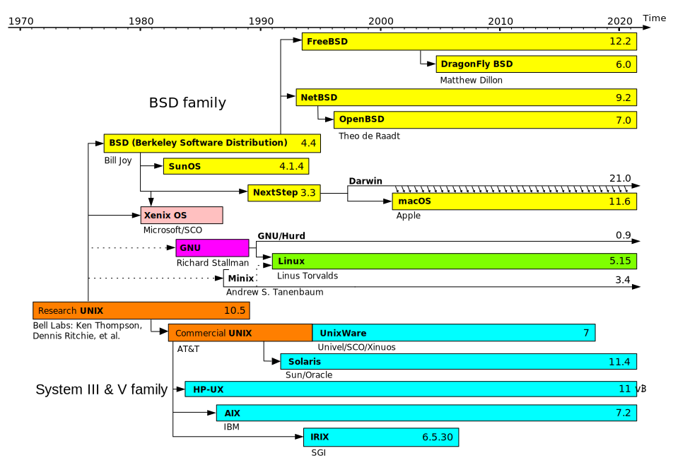
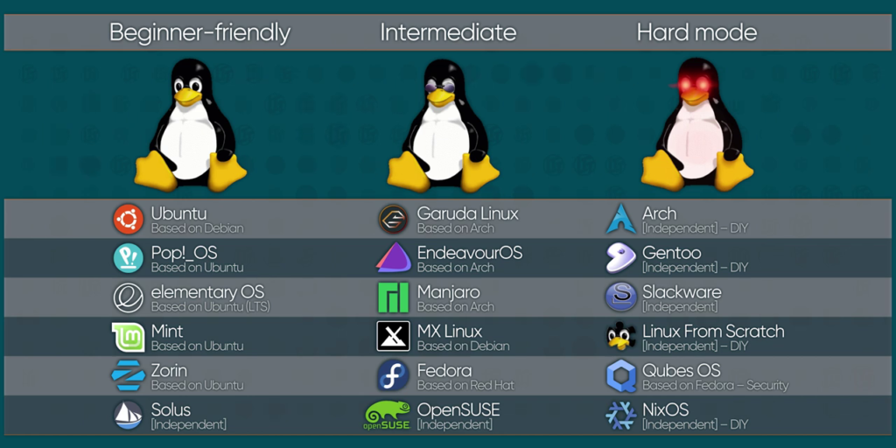

# Einführung in Linux

## 1. Die Wurzeln von Linux: Die Entwicklung von Unix

Vor der Schaffung von Linux existierten bereits andere Betriebssysteme, die jedoch in vielerlei Hinsicht weniger flexibel und leistungsfähig waren. Die Entwicklung von Unix in den späten 1960er Jahren war wegweisend und brachte Konzepte wie Multitasking, Mehrbenutzerfähigkeit und eine hierarchische Dateisystemstruktur hervor. Unix diente als Grundlage für viele moderne Betriebssysteme.

**Die Unix-Timeline zeigt die Entwicklung von Unix und verwandten Betriebssystemen über die Jahre hinweg.**

## 2. Die Entstehung von Linux

Linux wurde 1991 von Linus Torvalds entwickelt, der eine kostenlose Alternative zu den damals verbreiteten, aber teuren Unix-Betriebssystemen schaffen wollte. Torvalds veröffentlichte den Linux-Kernel, das Herzstück des Systems, und ermöglichte es Entwicklern weltweit, daran mitzuwirken.

## 3. Für was steht der Name Linux?

Der Name Linux setzt sich aus zwei Hauptbestandteilen zusammen:

Linus: Der Name stammt von Linus Torvalds, dem Entwickler des Linux-Kernels. Er begann 1991 mit der Entwicklung des Betriebssystems und benannte es ursprünglich nach sich selbst.

-ux: Der Suffix „-ux“ ist eine Anspielung auf Unix, das Betriebssystem, das Linus Torvalds inspirierte. Unix war ein wegweisendes Betriebssystem, das viele Konzepte und Prinzipien für Linux prägte.

## 4. Open Source und Distributionen

Das Besondere an Linux ist der öffentliche Zugriff auf den Quellcode, der jedem ermöglicht, das System zu verändern und anzupassen. Dies führte zur Entstehung zahlreicher Distributionen, wie Ubuntu, Fedora und Debian, die jeweils eigene Schwerpunkte und Funktionen bieten.

## 5. Die Bedeutung von Linux für Webentwickler

Linux hat sich besonders im Serverbereich, in der Softwareentwicklung und in der Webentwicklung etabliert. Viele Webserver (z.B. Apache, Nginx) laufen auf Linux, was es Entwicklern erleichtert, ihre Anwendungen direkt auf den Systemen zu testen, auf denen sie später betrieben werden.

---

## Warum Linux?

- **Kostenlos:** Keine Lizenzgebühren – ideal für Studenten und Unternehmen.
- **Gut gepflegt:** Eine weltweite Entwickler-Community sorgt für regelmäßige Updates und Sicherheit.
- **Flexibel:** Läuft auf fast allen Geräten – von PCs über Server bis hin zu IoT-Geräten.
  Große Wissensbasis: Viele Lösungen und Anleitungen online – leicht zu lernen und gefragt auf dem Arbeitsmarkt.

---

**Resources**

:movie_camera:[The Code - Die Geschichte von Linux [Doku] [Deutsch]](https://www.youtube.com/watch?v=JNbnW8P_PXs)
